---
<p align="center">
  
  
  
  
</p>

--- 

# ClickSmart 🧠✨

**ClickSmart** is a full-stack web-based cybersecurity quiz platform built to help students practice challenging questions in an interactive and gamified environment. The app features real-time XP tracking, question difficulty levels, user authentication (with Guest Mode), and a professional UI with engaging animations.
---
## 🎯 Features

- 🧠 100 curated cybersecurity questions (Easy, Medium, Hard)
- 🔐 Login, Sign-Up, and Guest login options
- 🧩 Real-time feedback with XP rewards
- ⏭️ Skip question and End Quiz functionality
- 📈 Profile page with XP and level tracking
- 💻 Responsive and animated user interface (Bootstrap + Custom CSS)
- 🗃️ MongoDB-powered question/answer storage and analytics

---

## 🛠️ Tech Stack

| Layer       | Technology               |
|-------------|---------------------------|
| Frontend    | HTML, CSS, JavaScript, Bootstrap |
| Backend     | Flask (Python)            |
| Database    | MongoDB (with Flask-PyMongo) |
| Auth & Crypto | bcrypt for password hashing  |

---

## ⚙️ Installation & Setup

```bash
# Clone the repo
git clone https://github.com/Manan-78581/ClickSmart
cd ClickSmart

# Create virtual environment (optional)
python -m venv venv
source venv/bin/activate  # or venv\Scripts\activate on Windows

# Install dependencies
pip install -r requirements.txt

# Setup MongoDB URI in `.env`
touch .env
echo "MONGO_URI=mongodb://localhost:27017/clicksmart" >> .env

# Run Flask Server
python app.py
```
---
## 🗃️ Data Flow Diagram


--- 

## 🧩 System Architecture
Frontend (Bootstrap + Vanilla JS)

REST APIs via Flask

MongoDB for persistent user/question storage

Environment secured via python-dotenv

```mermaid
flowchart LR
    User["🧑‍💻 User"]
    FE["🖥️ Frontend (HTML/CSS/JS)"]
    BE["⚙️ Flask Backend (Python)"]
    DB[(🗄️ MongoDB Database)]

    User <--> FE
    FE <--> BE
    BE <--> DB
```




---
## 📸 Screenshots


---
## 📄 License
This project is open-source and licensed under the MIT License.

---
## ✨ Acknowledgements
Project ideation, development, and architecture by Manan Kathuria.

---
## 🙋‍♂️ Author
Made with 🖤 by Manan Kathuria

